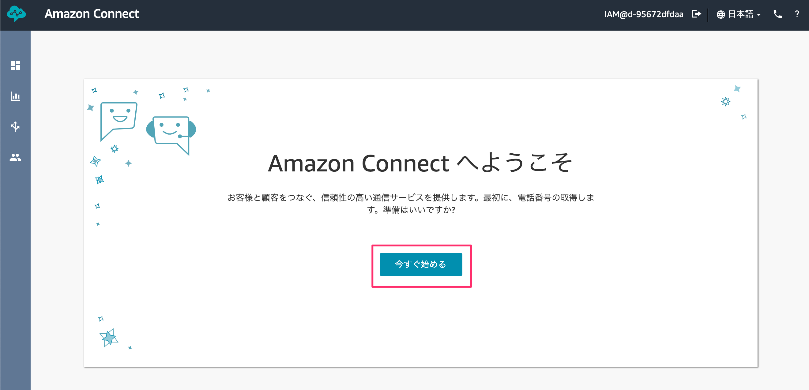
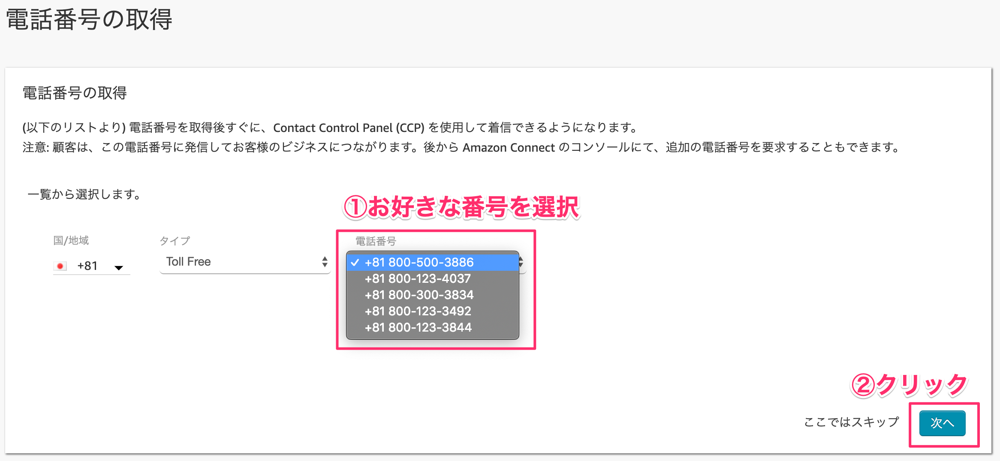
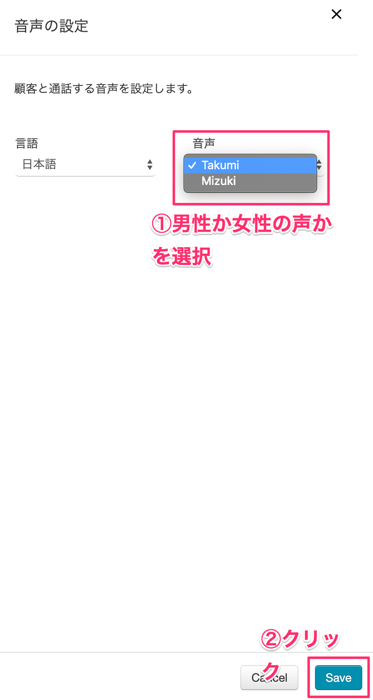
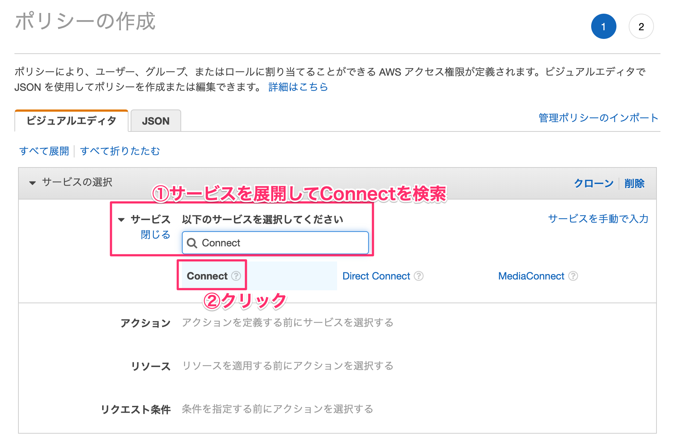
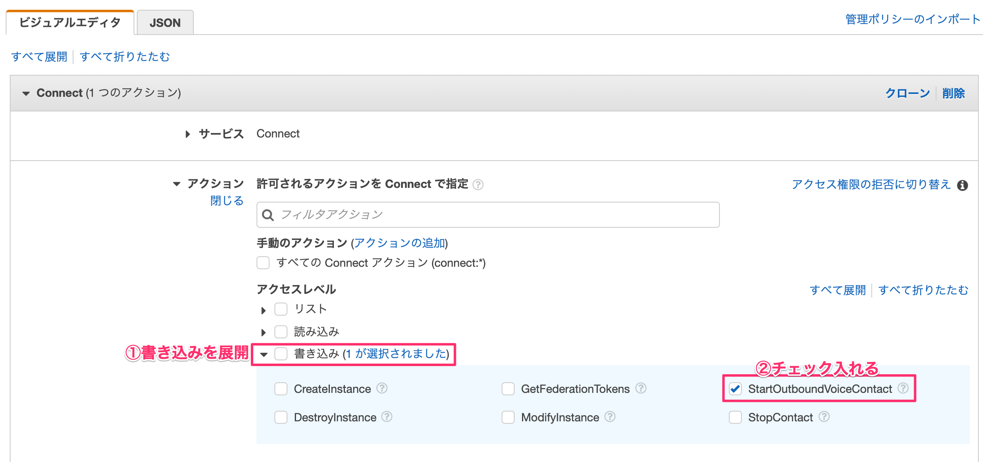

# 東京がおまる塾 Alexaスキル開発ハンズオン ～Amazon Connect連携編～

## リソースを作成する
### 1-1. リソースを作成する
AWSにアクセスし、お持ちのAWSアカウントでログインします。  
[https://aws.amazon.com/jp/](https://aws.amazon.com/jp/)

コンソール画面が開いたら、サービス検索から【Amazon Connect】と入力して検索します。
出てきた［Amazon Connect］をクリックします。


［今すぐ始める］ボタンをクリックします。


東京リージョンになっているか確認してください。
なっていない方は右上から「**アジアパシフィック（東京）**」を選択します。


アクセスURLに今回使用するための名前を決めます。

［tokyo-gaomar-{今日の日付}-{連番}］という感じで他の人と被らないような名前にします。


ステップ２の管理者の作成は後でできるので、「これをスキップ」を選択してから、［次のステップ］ボタンをクリックします。


ステップ３のテレフォニーオプションもそのまま何もせず［次のステップ］ボタンをクリックします。


ステップ４のデータストレージもそのまま［次のステップ］ボタンをクリックします。


ステップ５で最終確認をして問題なければ［インスタンスの作成］ボタンをクリックします。


1〜2分ほど作成に時間がかかります。


成功すれば、［今すぐ始める］ボタンをクリックします。


## 電話番号を取得しよう！

### 2-1.電話番号を取得する
Amazon Connect専用の電話番号を手に入れます。
別のタブでAmazon Connect用の画面が表示されるので、そこに表示されている［今すぐ始める］ボタンをクリックします。



電話番号の取得で、国は`Japan +81`を選択します。


次のタイプは2種類あります。お好きな方を選んでください。

| タイプ       |       特徴 |
|:-----------------|:------------------|
| Direct Dial             | 050番号が取得できる。発信者が通話料負担する。 |
| Toll Free             | 0800番号が取得できる。発信者の通話料無料（フリーダイヤル）開発者が負担する。 |


最後にお好きな番号を選択して、［次へ］ボタンをクリックします。

※ **取得した番号はメモしておきましょう**



［Continue］ボタンをクリックします。


## 問い合わせフローを作成しよう！

### 3-1.問い合わせフローを作成する
左メニューのルーティングから問い合わせフローをクリックします。


［問い合わせフローの作成］ボタンをクリックします。


問い合わせフローの名前を最初に設定しておきます。今回は **APLフロー** としました。


### 3-2.フローエディタに触れる
フローエディタを触っていきます。

左メニューの設定カテゴリを展開して、その中にある「音声の設定」をフローエディタにドラッグアンドドロップします。ドロップしたメニューをクリックします。


音声の設定で、言語は**日本語**を選択します。


音声は男性の声なら`Takumi`で女性の声なら`Mizuki`を選択します。お好きな方を選択してください。右下の［Save］ボタンをクリックします。



ブロックを繋いでいきます。エントリポイントの右にある○をクリックして引っ張ります。
そのまま出っ張っている部分に繋ぎます。
直感的に繋いていけるので初心者でも簡単に作ることができます。


操作カテゴリにあるプロンプトの再生ブロックをフローエディタにドラッグアンドドロップします。ドロップしたら、そのブロックをクリックします。


テキスト読み上げ機能（アドホック）を選択し、テキストを入力します。

```
<speak>
  <break time='2s' />
  アレクサから呼び出されたよ。APLは楽しいね！では、さようなら
</speak>
```

解釈する部分はプルダウンメニューから`SSML`を選択します。最後に［Save］ボタンをクリックします。


ブロックを繋いでいきます。


終了/転送カテゴリにある、切断/ハングアップのブロックをドラッグアンドドロップします。


線で結んでから、右上の下向き▼をクリックして、［保存して発行］をクリックします。


**追加のフロー情報の表示**部分を展開して、下線部の赤い部分のインスタンスIDと下線部の青い部分のコンタクトフローIDをそれぞれメモしておきます。


## Alexaスキルを作成しよう！
### 4-1. Alexaスキルを新規作成する

[こちら](https://developer.amazon.com/alexa/console/ask?)からログインしてください。ログインしたら、［スキルの作成］ボタンをクリックします。


スキル名はお好きな名前を設定します。モデルは「カスタム」で、「独自のプロビジョニング」を選択します。右上の［スキルを作成］ボタンをクリックします。


呼び出し名の部分をクリックします。呼び出し名はお好きな名前を入力してください。呼び出し名が設定できたら、［モデルを保存］ボタンをクリックします。


インターフェースをクリックします。その中にある「Displayインターフェース」と「Alexa Presentation Language」を有効にします。設定できたら［インターフェースを保存］ボタンをクリックします。


### 4-2. インテントを作成する
左側メニューのインテントにある［＋追加］をクリックします。インテント名を`CallIntent`と入力し、［カスタムインテントを作成］ボタンをクリックします。


サンプル発話に「電話をかけて」と入力して、［モデルを保存］と［モデルをビルド］ボタンをクリックします。


## Lambda関数を作成しよう！
### 5-1. Lambdaレイヤーを作成する
AWSにログインして、サービスから`Lambda`を検索して［Lambda］をクリックします。


Lambdaレイヤーと呼ばれる機能があります。予め使用するライブラリ群をアップロードしておいて、必要なライブラリをレイヤー単位でLambda関数に適用することができます。

左側メニューの`Layers`から［レイヤーの作成］ボタンをクリックします。


各項目を埋めていきます。linebot.zipは下記からダウンロードしてください。
[https://github.com/gaomar/tokyo-gaomar-01/raw/master/files/ask-sdk.zip](https://github.com/gaomar/tokyo-gaomar-01/raw/master/files/ask-sdk.zip)

［作成］ボタンをクリックします。

| 項目       |       値 |
|:-----------------|:------------------|
|名前|ASK-SDK|
|説明|ASK-SDK|
|アップロード|ask-sdk.zip|
|ランタイム|Node.js 8.10|


### 5-2. Lambda関数を作成する
Lambda関数を作成します。［関数の作成］ボタンをクリックします。


各項目を埋めていきます

| 項目       |       値 |
|:-----------------|:------------------|
|①関数名|AmazonConnect-Alexa|
|②ランタイム|Node.js 8.10|
|③実行ロール|AWSポリシーテンプレートから新しいロールを作成|
|④ロール名|AmazonConnect-Alexa-Role|
|⑤ポリシーテンプレート|基本的なLambda@Edgeのアクセス権限|


### 5-3. ポリシーの権限追加
関数が作成できたら、下にスクロールして、実行ロールという部分を探してください。
そこにある**AmazonConnect-Alexa-Roleロールを表示**という部分をクリックします。


［インラインポリシーの追加］をクリックします。


サービスを展開して、検索窓に「Connect」と入れて検索します。出てきた［Connect］をクリックします。



アクションのアクセスレベルにある「書き込み」部分を展開して、その中にある`StartOutboundVoiceContact`のチェックを入れます。



すべてのリソースを選択して、右下の［ポリシーの確認］ボタンをクリックします。


ポリシー名を入力します。`AmazonConnect-Alexa-Policy`としました。右下の［ポリシーの作成］ボタンをクリックします。


Lambda画面に戻り、画面更新するとAmazon Connectの権限が追加されます。

### 5-4. AlexaとLambdaと紐付ける
Lambda実行するためのトリガーとしてAlexa Skills Kitを紐付けます。
左側メニューにAlexa Skills Kitという部分があるので、クリックして追加します。


alexa developer consoleのエンドポイントをクリックします。AWS LambdaのARNを選択して、スキルIDをコピーします。
Lambda側にあるスキルIDに貼り付けます。貼り付けたら、［追加］ボタンをクリックします。


右上の［保存］ボタンをクリックします。Lambda側のARNの値をコピーして、alexa developer consoleのデフォルトの地域LambdaのARNの値を貼り付けます。

貼り付けたら、［エンドポイントを保存］をクリックします。


### 5-5. Lambdaレイヤーを適用する
5-1で作成したLambdaレイヤーを関数に適用します。
Layers部分をクリックして、［レイヤーの追加］をクリックします。


レイヤーの名前とバージョンを指定して、［追加］ボタンをクリックします。

| 項目       |       値 |
|:-----------------|:------------------|
|名前|ASK-SDK|
|バージョン|1|


### 5-6. index.jsを編集する
AmazonConnect-Alexa部分をクリックして、下にあるindex.jsのファイルを編集します。

index.jsの内容は下記からコピーしてください。
[https://raw.githubusercontent.com/gaomar/tokyo-gaomar-01/master/files/index.js](https://raw.githubusercontent.com/gaomar/tokyo-gaomar-01/master/files/index.js)


```javascript:index.js
const Alexa = require('ask-sdk-core');
const AWS = require('aws-sdk');
var connect = new AWS.Connect();

// スキル起動時
const LaunchRequestHandler = {
    canHandle(handlerInput) {
        return Alexa.getRequestType(handlerInput.requestEnvelope) === 'LaunchRequest';
    },
    handle(handlerInput) {
        const speechText = 'メニューをタップしてください。';
        return handlerInput.responseBuilder
            .speak(speechText)
            .addDirective({
                type : 'Alexa.Presentation.APL.RenderDocument',
                version: '1.0',
                token: "token",
                document: require('./apl_top.json')
            })            
            .getResponse();
    }
};

// 画面タッチ処理
// シミュレーターではonPressが反応し、実機ではPressが反応するため2つ書いておく
const TouchEventHandler = {
    canHandle(handlerInput) {
    return ((Alexa.getRequestType(handlerInput.requestEnvelope) === 'Alexa.Presentation.APL.UserEvent' &&
        (handlerInput.requestEnvelope.request.source.handler === 'Press' || 
        handlerInput.requestEnvelope.request.source.handler === 'onPress')));
    },
    async handle(handlerInput) {
        
        // 電話をかける
        CallAction();
        
        const speechText = '電話をかけます。'
        return handlerInput.responseBuilder
            .speak(speechText)
            .getResponse();
    }
};

// 電話をかける処理
function CallAction() {
    var params = {
        InstanceId: process.env.INSTANCEID,
        ContactFlowId: process.env.CONTACTFLOWID,
        DestinationPhoneNumber: process.env.PHONENUMBER,
        SourcePhoneNumber: process.env.SOURCEPHONENUMBER
    };

    var calling =connect.startOutboundVoiceContact(params, function(err, data) {
        if (err) {
          console.log(err);
        }
    });
}

// ヘルプ
const CallIntentHandler = {
    canHandle(handlerInput) {
        return Alexa.getRequestType(handlerInput.requestEnvelope) === 'IntentRequest'
            && Alexa.getIntentName(handlerInput.requestEnvelope) === 'CallIntent';
    },
    handle(handlerInput) {
        
        // 電話をかける
        CallAction();
        
        const speechText = '電話をかけます。';
        return handlerInput.responseBuilder
            .speak(speechText)
            .getResponse();
    }
};

// ヘルプ
const HelpIntentHandler = {
    canHandle(handlerInput) {
        return Alexa.getRequestType(handlerInput.requestEnvelope) === 'IntentRequest'
            && Alexa.getIntentName(handlerInput.requestEnvelope) === 'AMAZON.HelpIntent';
    },
    handle(handlerInput) {
        const speechText = 'メモを保存する場合は「メモをセーブ」。メモを聞く場合は「メモをロード」と言ってください。それではどうぞ！';

        return handlerInput.responseBuilder
            .speak(speechText)
            .reprompt(speechText)
            .getResponse();
    }
};

// キャンセルor終了と発話された
const CancelAndStopIntentHandler = {
    canHandle(handlerInput) {
        return Alexa.getRequestType(handlerInput.requestEnvelope) === 'IntentRequest'
            && (Alexa.getIntentName(handlerInput.requestEnvelope) === 'AMAZON.CancelIntent'
                || Alexa.getIntentName(handlerInput.requestEnvelope) === 'AMAZON.StopIntent');
    },
    handle(handlerInput) {
        const speechText = 'バイバイ！またね！';
        return handlerInput.responseBuilder
            .speak(speechText)
            .getResponse();
    }
};

// セッション切れ
const SessionEndedRequestHandler = {
    canHandle(handlerInput) {
        return Alexa.getRequestType(handlerInput.requestEnvelope) === 'SessionEndedRequest';
    },
    handle(handlerInput) {
        // Any cleanup logic goes here.
        return handlerInput.responseBuilder.getResponse();
    }
};

// エラー時
const ErrorHandler = {
    canHandle() {
        return true;
    },
    handle(handlerInput, error) {
        console.log(`~~~~ Error handled: ${error.message}`);
        const speechText = `不明なエラーが出ました`;

        return handlerInput.responseBuilder
            .speak(speechText)
            .reprompt(speechText)
            .getResponse();
    }
};

// 各種Handlerを登録する
exports.handler = Alexa.SkillBuilders.custom()
    .addRequestHandlers(
        LaunchRequestHandler,
        HelpIntentHandler,
        CallIntentHandler,
        TouchEventHandler,
        CancelAndStopIntentHandler,
        SessionEndedRequestHandler)
    .addErrorHandlers(
        ErrorHandler)
    .lambda();

```

### 5-7. APLファイルを新規作成する
index.jsで指定しているapl_top.jsonファイルを新規作成します。
＋マークをクリックして、ファイルを追加します。


下記ファイルをコピペしてください。

[https://raw.githubusercontent.com/gaomar/tokyo-gaomar-01/master/files/apl_top.json](https://raw.githubusercontent.com/gaomar/tokyo-gaomar-01/master/files/apl_top.json)

```javascript:apl_top.json
{
    "type": "APL",
    "version": "1.0",
    "theme": "dark",
    "import": [],
    "resources": [],
    "styles": {},
    "layouts": {},
    "mainTemplate": {
        "parameters": [
            "payload"
        ],
        "items": [
            {
                "type": "Container",
                "direction": "column",
                "item": [
                    {
                        "type": "Text",
                        "textAlign": "center",
                        "paddingTop": "15vh",
                        "text": "メニュー選択"
                    },
                    {
                        "type": "Container",
                        "direction": "row",
                        "alignItems": "center",
                        "justifyContent": "center",
                        "width": "100vw",
                        "height": "50vh",
                        "paddingTop": "10vh",
                        "items": [
                            {
                                "type": "Container",
                                "item": [
                                    {
                                        "type": "TouchWrapper",
                                        "onPress": {
                                            "type": "SendEvent",
                                            "arguments": [
                                                "save"
                                            ]
                                        },
                                        "item": [
                                            {
                                                "type": "Frame",
                                                "borderRadius": 10,
                                                "backgroundColor": "green",
                                                "item": [
                                                    {
                                                        "type": "Text",
                                                        "width": "60vw",
                                                        "height": "20vh",
                                                        "textAlign": "center",
                                                        "textAlignVertical": "center",
                                                        "fontSize": "7vw",
                                                        "text": "電話をかける"
                                                    }
                                                ]
                                            }
                                        ]
                                    }
                                ]
                            }
                        ]
                    }
                ]
            }
        ]
    }
}

```

コードをコピペできたら、ファイルを保存します。ファイル名は「apl_top.json」としてください。［Save］ボタンをクリックします。

※ファイル名はスペルミスしないように気をつけてください


### 5-8. LambdaからAmazon Connectの環境を設定する
index.jsに環境変数として設定している項目を埋めていきます。

※キー名はスペルミスをしないように気をつけてください

| 項目       |       値 |
|:-----------------|:------------------|
|INSTANCEID|下線部の赤い値|
|CONTACTFLOWID|下線部の青い値|
|PHONENUMBER|かけたい電話番号 <br>※+81をつけます（かけたい電話番号を間違えないように！）|
|SOURCEPHONENUMBER|Amazon Connectで取得した電話番号|


右上の［保存］ボタンをクリックします。


### 5-7. シミュレーターで確認する
alexa developer console画面を表示して、［テスト］タブをクリックします。
プルダウンメニューから「開発中」を選択して、4-1で設定した呼び出し名を入力してスキルを起動させます。

［電話をかける］ボタンをクリックすると、指定した番号に電話がかかってきます。


